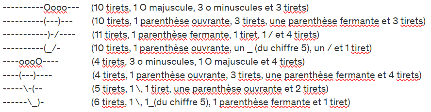

# Exercice 001 - ASCII Text Art

## Objectif
A la fin de cet exercice, vous serez capable d'afficher du texte dans la console avec Java, y compris des charactères spéciaux.

## Expression du besoin
Affichez dans la console le dessin suivant, en utilisant uniquement l'instruction `System.out.println()`:

## Modèle
Si vous ne savez pas par où commencer :

    public class AsciiArt {
        public static void main(String... args){
            System.out.println("----------Oooo---");
            System.out.
        }
    }

## Astuce
Les caractères spéciaux tels que &#92; ou &rdquo; par exemple doivent être échappés (prefixés) par un &#92;

Exemple: &#92;&#92; devient &#92;